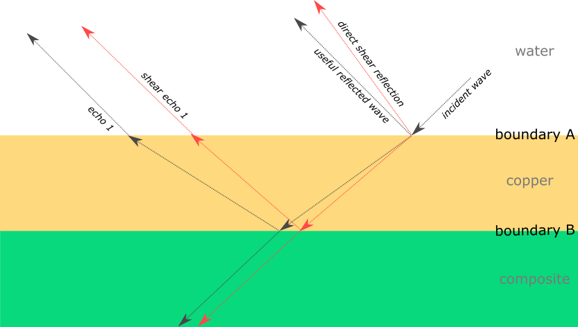

# Acoustic implications of using a mirror
[TOC]

## Problem description

* Problem 1 (solved): define the angles of all reflected and transmitted longitudinal (black vectors) and shear (red vectors) waves.
* Problem 2 (solved): situate the echos, that is, the distance between the useful reflected wave and the echos
* Problem 3 (in progress): determine the magnitude of all vectors



## Results

* Critical angle of longitudinal transmission from water to copper : 19.4°.
* Critical angle of shear transmission from water to copper : 39.7°
* The incident angle (45°) is greater than the critical angles of longitudinal and shear transmission, therefore, there is no transmission of the incident wave into the copper layer, therefore neither longitudinal nor shear echo ([total internal reflection](https://en.wikipedia.org/wiki/Total_internal_reflection)).
* There is a direct shear reflection of 20.7°

*(To reproduce the results, execute in Octave the script “acousticsOfMirrors.m”)*

## Method

* The angles of the longitudinal and shear waves transmitted and reflected in the case of a longitudinal wave hitting a boundary between two media A and B are given by [Snell's law](https://de.wikipedia.org/wiki/Snelliussches_Brechungsgesetz#Akustik):
```
sin(a)/vLA = sin(aRS)/vSA = sin(aRL)/vLA = sin(aTS)/vSB = sin(aTL)/vLB
Where
  * a is the incident angle
  * vLA is the velocity of longidudinal waves in the medium A
  * aRS is the angle of the reflected shear wave in medium A
  * vSA is velocity of shear waves in the medium A
  * aRL is the angle og the reflected longitudinal wave in medium A
  * vLA is the velocity of longitudinal waves in the medium A
  * aTS is the angle of the transmitted shear wave in medium B
  * vSB is the velocity of shear waves in the mediom B
  * aTL is the transmitted longitudinal wave in medium B
  * vLB is the velocity of longitudinal waves in the B
```

* The critical angle of wave transmission is the angle above which an incindent wave is totally reflected. It is  [derived from Snell's law](https://en.wikipedia.org/wiki/Snell%27s_law#Total_internal_reflection_and_critical_angle): 
```
alpha = asin (vA/vB)
Where
  * alpha is the critical angle
  * vA is the velocity of longitudinal waves in medium A
  * vB is the velocity of longitudinal waves in medium B
```

## Variables

Compressional velocity (speed of longitudinal wave propagation, in m/s):
-   In copper :
    -   4660 [2]
    -   4760 (annealed) [6]
    -   4760 (annealed) [7]
    -   4660 [10]
    -   3560 [13]
-   In air:
    -   331.45 (dry) [6]
    -   331.2 (dry at 0°C) [8]
    -   331 [13]
-   In composite:
    -   4726 (Glass fiber-reinforced polyester composite) [9]
    -   3070 (graphite/epoxy) [10]
    -   2100 (L385:340 epoxy at 20°C) [11]
    -   2460 to 3170 (depending on thickness and material ratio) [14]
-   In water:
    -   1480 (at 20°C) [10]
    -   1483 (at 20°C) [12]
    -   1484 [8]
    -   1493 [13]
    -   1496 (distilled) [6]
Shear velocity (speed of shear wave propagation, in m/s):
-   In copper:
    -   2330 [2]
    -   2325 [6]
    -   2325 [7]
-   In composite:
    -   No data found. As default value we take compression velocity / sqrt(2)
-   In water and air: no shear wave propagation
Acoustic impedence (in Ns/m³):
-   Copper:
    -   41.6e6 [3]
-   Air
    -   413 (at 20°C) [3]
-   Water
    -   1.48e6 [3]

## References

[1] https://www.slideshare.net/RakeshSingh125/minor-project-report-28478524, p 9-12
[2] https://www.slideshare.net/RakeshSingh125/minor-project-report-28478524, p 15
[3] https://www.slideshare.net/RakeshSingh125/minor-project-report-28478524, p 16
[4] https://www.slideshare.net/RakeshSingh125/minor-project-report-28478524, p 17
[5] https://www.slideshare.net/RakeshSingh125/minor-project-report-28478524, p 18
[6] http://www.rfcafe.com/references/general/velocity-sound-media.htm
[7] https://en.wikipedia.org/wiki/Speeds_of_sound_of_the_elements_(data_page)
[8] https://en.wikipedia.org/wiki/Speed_of_sound
[9] https://arxiv.org/ftp/arxiv/papers/1511/1511.04543.pdf
[10] https://www.olympus-ims.com/de/ndt-tutorials/thickness-gage/appendices-velocities/
[11] http://www.ndt.net/article/wcndt2004/pdf/materials_characterization/616_mchugh.pdf
[12] http://www.ondacorp.com/images/Liquids.pdf
[13] http://hyperphysics.phy-astr.gsu.edu/hbase/Tables/Soundv.html
[14] http://citeseerx.ist.psu.edu/viewdoc/download?doi=10.1.1.457.3039&rep=rep1&type=pdf
