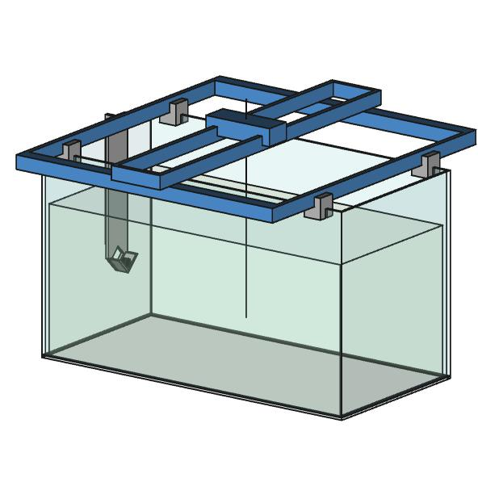

# Project

## Name

[`2017-09-01 PRJ echo_bench`]()

## Title

Banc de caractérisation automatique de transducteurs à ultrasons.

## Description

D'après spécifications  

## Liste du matériel

* Carte d'acquisition US-SPI, Lecoeur Electronique, http://www.lecoeur-electronique.net/crbst_16.html

* Raspberry Pi Zero W, https://www.raspberrypi.org/products/raspberry-pi-zero-w/

* Table XY en kit, XY Plotter Robot Kit, Makeblock, http://store.makeblock.com/xy-plotter-robot-kit

* Pièces adaptatrices en impression 3D (pieds, support transducteur, support cible...)

## Ressources
* Documentation US-SPI : 

## Installation

### RPi zero W

TODO ...
